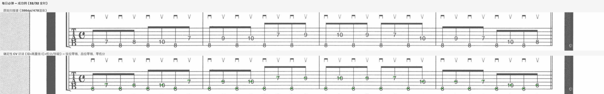
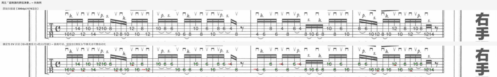

# 365togp（已放弃 / 归档）

> **项目状态：已放弃（2026-07-09）。** 本 README 作为复盘留存：记录做成了什么、卡在哪、
> 为什么最终判断"扫描吉他谱全自动转 GP"这条路在本书上不划算。代码可跑、5 段成品可用，
> 但达不到"零静默错误 + 全自动"的初衷，故封存。

把宫胁俊郎《365日！电吉他手的养成计划》的扫描谱页，转成可导入 Guitar Pro / TuxGuitar
播放练习的 `.gp5`。以第 9 周（拨片跨弦，7 段）为试点。

---

## 原图 vs 转谱对比

**成功例 —— 每日必弹（32/32 全对）**



上为原始扫描谱，下为确定性 CV（NCC 模板匹配）识读结果。绿标=高置信、红标=低分/存疑。
这段弦位零错、品位零错、零低分——高清源 + 重建模板库后，简单段落已能全自动读准。

**失败例 —— 周五「超刺激的跨弦演奏」**



密集 16 分 + 连奏（h.=击弦 p.=勾弦 s.=滑弦）+ 分解和弦。音高大体可读，但**弦位**（跳弦段
读谱器会 ±1 漂移）和**节奏**（时值分组）无法可靠自动化——这类段落每个音都得人工核，
自动化的意义就没了。

---

## 做成了什么（有效成果）

- **高清源迁移**：新扫描 PDF 内嵌图是真 300dpi（2544×3508），旧版仅 ~150dpi。渲染 DPI 定为
  **470**，使页宽与旧管线一致、坐标魔数 1:1 复用，同时字形细节翻倍。这一步把简单段的识读
  准确率直接抬上去（每日 71.9%→100%、周一 53%→96.7%、周二 68%→100%）。
- **模板库重建**（检测器锚定挖掘 + 互相关一致性择优去噪，覆盖品位 5–17）。
- **确定性识读 + 机械对账**（`tab_reader` + `reconcile`），坚持"零静默错误"：低置信/冲突一律
  标红进复核清单，不臆测。
- **成品**：`output/week09_verified.gp5`（每日~周四 5 段，可用）、`output/week09_full7.gp5`
  （7 段，周五/周六为草稿）。28 个回归测试全绿。

## 为什么放弃（撞到的墙）

1. **跳弦段弦位天然歧义**。本周是"跨弦(string-skip)"技法，"跨越X弦"=跳过X弦。密集连奏里
   数字被符杠/连音弧线干扰，印在两条弦线之间，读谱器在弦5/弦6 间 18:14 分裂，谁都对不齐。
   （连带发现原 GT 把周四下声部误标弦5，实为弦6——**连真值本身都不可靠**。）
2. **音频裁决失效**。想用示范音频定弦位：弦5/弦6 差纯四度、本该能分，但①失真吉他泛音铺满
   所有音级、②连奏无独立起音没法对齐。装了 demucs 分离吉他声部、跑 basic-pitch，三种声部
   投票仍是平局（13:13 / 14:13 / 13:12）。**音频这条退路也断了**。
3. **密集段节奏无法可靠自动化**。16 分三连群 + 8 分 + 休止 + 分解和弦的组合，靠间距启发式
   会造出错节奏（=假数据），只能逐小节人工读符杠。
4. **结论**：对这本书，OMR 全自动只在简单段成立；难段（周五/周六及跳弦段的弦位）每音都需
   人工复核，自动化省不下人力，ROI 为负。**商业方案 Soundslice** 仍是这类需求唯一对口工具。

## 如果要重启，需要的不是更努力

- 弦位歧义：需要**逐音人工裁定**或更高质量的原谱（非扫描件）。
- 音频路线：换 **Moises**（moises.ai，带扒谱/变速）或 Logic Stem Splitter 或许能改善分离，
  但失真+连奏的根本问题仍在。
- 节奏：需要真正的符杠/时值解析器（本项目未实现），或直接人工转写难段。

---

## 管线与代码（供参考）

```
render(470dpi) → segment → tab_reader(NCC识读) → reconcile(对账) → build_gp5 → verify
```

| 模块 | 作用 |
|------|------|
| `src/render.py` | PDF 页 → PNG（`--dpi 470`） |
| `src/segment.py` | 整页 → 每条乐句系统块切图 |
| `src/tab_reader.py` | NCC 模板匹配识读 → (弦,品,x,置信度) |
| `src/reconcile.py` | 识读结果 × GT JSON 机械对账，出复核清单 |
| `src/build_gp5.py` | 乐句 JSON → `.gp5`（PyGuitarPro，cp936 编码） |
| `src/verify.py` | `.gp5` → ASCII TAB 回读校验 |
| `src/tabcheck.py` | 乐理弦位校验（音域/调性/大跳） |
| `work/*.py` | 一次性脚本：模板挖掘、音频裁决、demucs 分离等（不入库） |

复盘细节见 [`docs/accuracy-plan-v2.md`](docs/accuracy-plan-v2.md)。

## License

MIT
